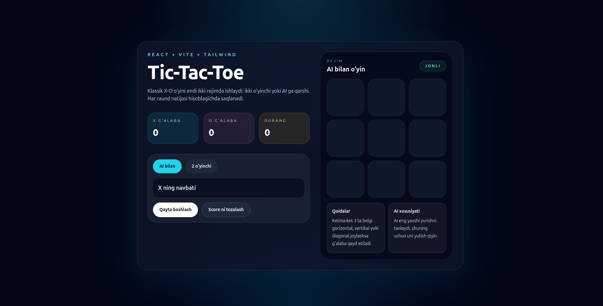

# Tic-Tac-Toe

A modern Tic-Tac-Toe game built with React and Vite. The project includes two play modes, live score tracking, winner highlighting, and an AI opponent powered by the minimax algorithm.

## Project Demo



## Live Preview

[Open the live demo](https://tic-tac-toe-henna-eta-47.vercel.app/)

## Features

- Classic 3x3 Tic-Tac-Toe board
- Two modes: `Player vs AI` and `2 Players`
- Smart AI using the minimax algorithm
- Automatic winner detection
- Winning line highlight
- Draw detection
- Live score tracking for `X`, `O`, and draws
- Restart current round
- Reset the full scoreboard
- Responsive UI built for desktop and mobile screens

## Tech Stack

- React
- Vite
- Tailwind CSS via CDN

## Getting Started

### Prerequisites

- Node.js 18+ recommended
- npm

### Install dependencies

```bash
npm install
```

### Start the development server

```bash
npm run dev
```

### Build for production

```bash
npm run build
```

### Preview the production build

```bash
npm run preview
```

## Game Modes

### Player vs AI

Play as `X` against an AI that makes optimal moves using minimax.

### 2 Players

Two local players can take turns on the same device.

## Gameplay

- `X` always starts first
- The first player to align 3 symbols horizontally, vertically, or diagonally wins
- If all cells are filled and nobody wins, the round ends in a draw
- Scores are updated automatically after every round

## Project Structure

```text
tic-tac-toe/
├── index.html
├── package.json
├── vite.config.js
├── project-demo.png
└── src/
    ├── App.jsx
    ├── main.jsx
    └── styles.css
```

## Notes

- Tailwind CSS is loaded from the CDN in `index.html`.
- The AI logic is implemented in `src/App.jsx`.
- `node_modules` and `dist` are ignored through `.gitignore`, so the project is ready to upload to GitHub.
